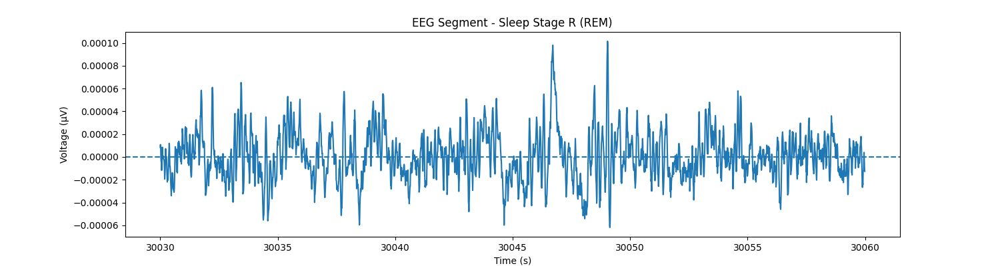

# Automated EEG Signal-Based Sleep State Classification and Analysis

## Overview
This project presents an automated approach for
sleep stage classification using electroencephalogram (EEG) signals from the PhysioNet Sleep-EDF Expanded dataset. Manually
scoring these signals is time-consuming and subject to variability,
motivating the use of machine learning for automation. In this
work, classical models and a 1D Convolutional Neural Network are
used to classify 30-second EEG epochs into five sleep stages:
Wake, N1, N2, N3, and REM. EEG signals were preprocessed
and segmented, with handcrafted features extracted for classical
models, while the 1D-CNN operated directly on raw EEG signals.
Performance was evaluated using accuracy, balanced accuracy,
and macro F1-score. Results show that the 1D-CNN outperforms classical methods, particularly in minority classes such
as REM, while N1 remains the most challenging stage due to its
transitional nature.

  <em>Figure 1. 30-second Epoch Segment - REM</em>

## Authors
- **Christian Bammann** – Contributor of all data preprocessing, SVM/RF/CNN model development, experimentation, evalutation, and report/presentation preparation.

## Contents

| File                                                                                     | Description                                                 |
|------------------------------------------------------------------------------------------|-------------------------------------------------------------|
| `figures`                                                                                | Folder containing visualization figures                      |
| `outputs`                                                                                | Folder containing metrics and plots for each model                            |
| `training`                                                                               | Folder containing all Python training notebooks                                |
| `README.md`                                                                              | Project Overview                                             |
| `report.pdf`                                                                             | IEEE-style Report                                              |
| `requirements.txt`                                                                       | List of required dependencies                                            |

## Running the Project
Run the notebooks in the 'training/' directory:
- `classical_eeg.ipynb`
- `cnn_eeg.ipynb`

## Table I:  Overall Model Performance Comparison

| Model                               | Acc    | Balanced Acc   | Macro F1                    | 
|-------------------------------------|-----------------------------|-----------------------------|-----------------------------|
| SVM              | 86.9%                      | 79.6%                      | 72.1%                       |
| RF       | 92.2%                       | 72.0%                       | 74.4%                       |
| 1D-CNN   | 93.0%                      | 83.3%                      | 79.9%                       |

## Table II: Per-Class F1 Performance Comparison

| Model   | Wake  | N1    | N2    | N3    | REM   |
|---------|-------|-------|-------|-------|-------|
| SVM     | 94.0% | 28.6% | 84.4% | 80.6% | 52.9% |
| RF      | 95.6% | 28.0% | 84.5% | 82.9% | 66.3% |
| 1D-CNN  | 98.7% | 37.4% | 88.0% | 86.4% | 77.7% |

## Dataset
Link to PhysioNet Sleep-EDF Expanded Dataset: [Sleep-EDF Dataset](https://physionet.org/content/sleep-edfx/1.0.0/)

## Conclusion

This work presents an automated approach for sleep stage
classification using both classical machine learning models and
a 1D convolutional neural network. The 1D-CNN achieved the
best overall performance, with notable improvements in macro
F1-score and balanced accuracy, demonstrating its ability to
better handle class imbalances and capture complex EEG
signal patterns.
While the model shows strong performance, particularly in
the Wake and N2 stages, the N1 stage remains a key challenge
to classify due to its transitional and ambiguous nature. These
results emphasize that performance evaluation should prioritize class-balanced metrics and clinically meaningful outcomes
rather than overall accuracy alone.
From a clinical standpoint, accurate classification of sleep
stages such as N3 and REM are essential for assessing sleep
quality and supporting diagnosis of sleep disorders. The improvements demonstrated in this work highlight the potential
of deep learning methods for scalable and consistent sleep
analysis
